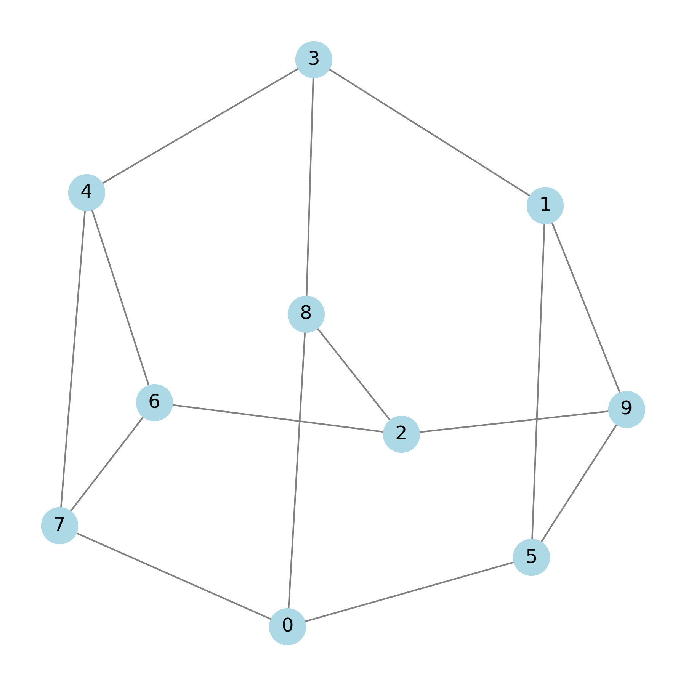
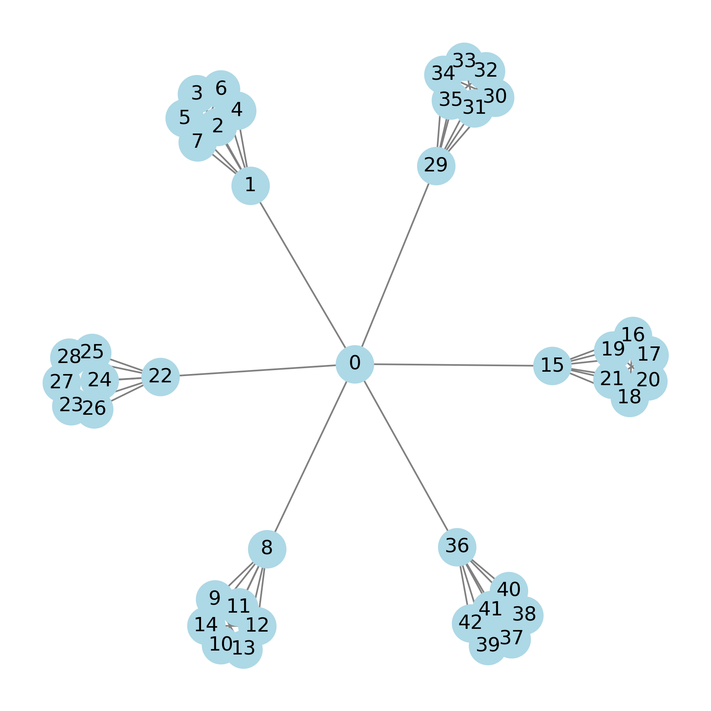
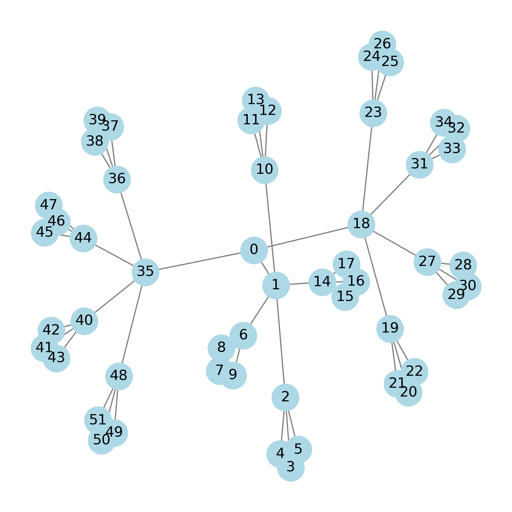

# Comparison of Different Search Algorithms in Peer-to-Peer Network

CSC 466 - Overlay and peer to peer networks
Semester Project
Spring 2025

---

## Table of Contents

- [Project-Overview](#project-overview)
- [Course Information](#course-information)
- [Team Members](#team-members)
- [Objective](#objective)
- [Overview](#overview)
- [Technologies Used](#technologies-used)
- [Features](#features)
- [Installation & Setup](#installation--setup)
- [Usage](#usage)
- [Limitations & Future Work](#limitations--future-work)
- [References](#references)
- [License](#license)

---

## Project Overview

---

## Course Information
This project was created for CSC466: Advanced Topics in Computer Networks at the University of Victoria.

The course focuses on Layer 3 and above, and the control plane of the Internet, particularly with overlay and peer-to-peer networking.

The following project investigates P2P query routing techniques such as flooding, normalized flooding, and random walks using custom-built topologies and simulation tools.

---

## Team Members

| Name            | Student ID | Email                |
| --------------- | ---------- | -------------------- |
| Holly Gummerson | V00986098   | hgummerson@uvic.ca   |
| Ali Gaineshev   | V00097349   | ggaineshev@gmail.com |
| Mathew Terhune  | V00943466   | mterhune@uvic.ca     |

---

## Objective

Create and simluate a decentralized unstructured peer-to-peer network, gathering statistics on different search methods

---

## Overview

---

## Technologies Used

* Nice visualiztion website - https://graphonline.top/en/
* Import graphml file into it
---

# Features

- Different topologies
- Flooding, normalized flooding, k-random walks
- Packet forwarding and recieving
- Animation functionality

---

## Installation & Setup

### Prerequisites

- g++ / gcc:C++ Compiler (C++17 support needed)
- Python3 : Python Bindings / waf system
- cmake
- git


GITHUB VERSION

Navigate to where you would like to install NS-3 to and then run.

`git clone https://gitlab.com/nsnam/ns-3-dev.git`

#### Makefile setup

#### Project Structure

### Clone the repository

# Running the code TEMP PlEASE LOOK HERE
replace the whole scratch folder content with this. Then

To start:

```
./ns3 clean
./ns3 configure --disable-werror --disable-warning
```

To run tree topology:

```
./ns3 build && ./ns3 run "scratch/code/network-sim.cc --nodeNum=10 --srcIndex=0 --sinkIndex=9"
```

To run file:

```
 ./ns3 build && ./ns3 run "scratch/code/network-sim.cc --fileName=filepath  --srcIndex=0 --sinkIndex=9"
```
Then add network type:

* 1 - TREE
* 2 - LINEAR
* 3 - READ_FILE


```
--networkType=X
```

After that add *Search Algorithm*:

For Flood:
```
--searchAlg=0
```

For Random Walk:
```
--searchAlg=1 --walkers=k
```

For Normalized Flood:
```
--searchAlg=2 --walkers=k
```

To set up initial ttl:
```
--ttl=X
```

To set output folder please use:
```
--outputFolder=3_regular_50_nodes
```

#### Example calls:

* Flood with initial ttl 5 and tree topology
```
./ns3 build && ./ns3 run "scratch/code/network-sim.cc --searchAlg=0 --networkType=1 --nodeNum=10 --srcIndex=0 --sinkIndex=9  --ttl=5 --outputFolder=misc"
```

* running a file with random walk and 6 walkers
```
 ./ns3 build && ./ns3 run "scratch/code/network-sim.cc --searchAlg=1 --networkType=3 --fileName=scratch/code/graphs/3_regular_with_50_nodes.txt  --srcIndex=0 --sinkIndex=9 --walkers=5 --outputFolder=3_regular_50_nodes"
```

#### Running Network Anim

```
./netanim-3.109/NetAnim
```
After NetAnim opens:

1. Select 'Open XML trace file'
2. Open "p2p-network-routing.xml" from the ns3 folder
3. Press 'Play animation'

#### Running Graph Generator

* Creating a regular graph connected with x edges and y nodes 
```
% python ./graph_generator.py regular x y
```
Regular graph with 3 edges and 10 nodes:



* Creating a cluster graph with x groups of y nodes
```
% python ./graph_generator.py cluster x y
```

Cluster graph with 6 clusters of 7 nodes:



* Creating a mega-graph connected with subcluster one containing x groups of y nodes so on ...
```
% python ./graph_generator.py megagraph x y a b ... d e
```

Mega-graph with 3 seperate clusters, all containing 4 groups with 4 nodes:


## Usage

---
